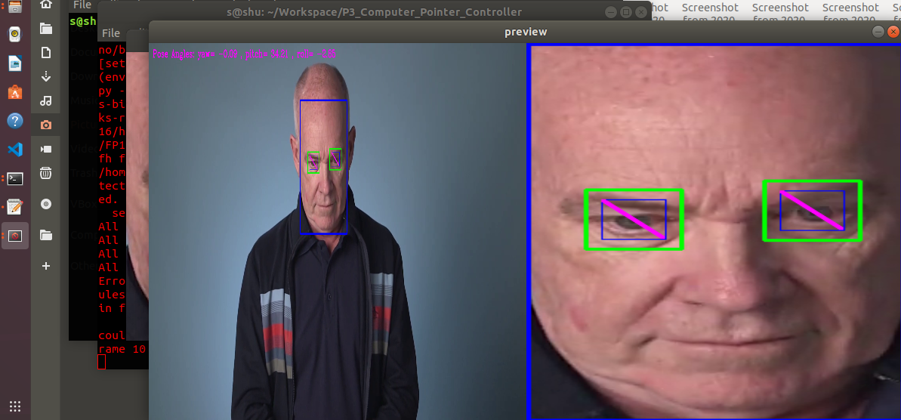
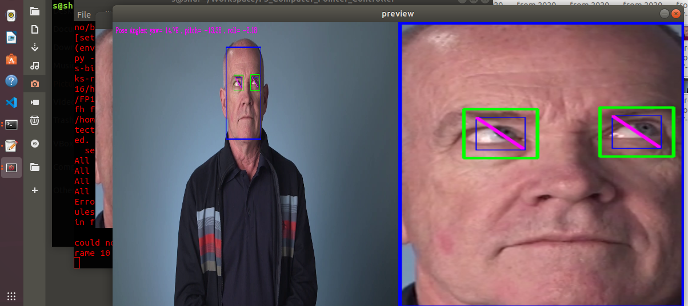
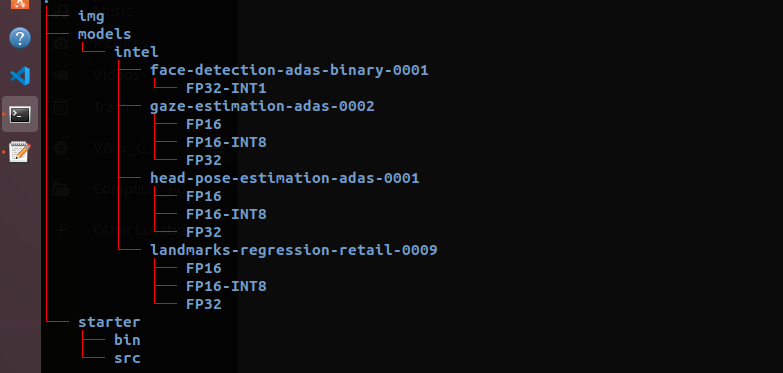

# Computer Pointer Controller
## Introduction

The Computer Pointer Controller main fucntionaly is moving the computer mouse using a gaze of a person, to achieve that four deep learnig models used: face detection model, landmarks estimation, head pose estimation and finally the gaze estimation model.

## Project Set Up and Installation

### Setup
#### Prerequisites
* You need to install openvino successfully.
* See [this guide](https://docs.openvinotoolkit.org/latest/openvino_docs_install_guides_installing_openvino_linux.html) for installing openvino.

* The project is organized in folders, starter folder contains the `src` folder which is for the source code, the `bin` folder which is for videos and images to use a input, the `models` folder is for the IR models
used in the project.

* The application is developed and test using openvino 2020.4, in order to install the toolkit in linux refer to the [official documentataion](https://docs.openvinotoolkit.org/latest/openvino_docs_install_guides_installing_openvino_linux.html).

In order to get started with the application, you should first download the necessary models:


```
$ source /opt/intel/openvino/bin/setupvars.sh

$ cd /opt/intel/openvino/deployment_tools/tools/model_downloader/

$ sudo pip3 install -r requirements.in

$ sudo python3 downloader.py --name face-detection-adas-binary-0001

$ sudo python3 downloader.py --name landmarks-regression-retail-0009

$ sudo python3 downloader.py --name head-pose-estimation-adas-0001

$ sudo python3 downloader.py --name gaze-estimation-adas-0002

```

After downloading the needed IR models for the execution of the application now install the application dependencies:

To install project dependencies in an isolated environment, we create a python virtual environment:

```
$ python3 -m venv /path/

$ source /path/environment/bin/activate

$ sudo pip3 install -r requirements.txt
```

## Demo

The following shows a demonstartion about the application:
Youtube link for ouutput video:

<table>
  <tr>
    <td>demo1</td>
     <td>demo2</td>
  </tr>
  <tr>
    <td></td>
    <td></td>
  </tr>
 </table>

## Documentation

The following image shows the pipeline of the application which consists of: detecting the person face, feeding the cropped face into the head pose estimation model and the landmarks estimation model, then feeding the outputs of the head pose estimation along with the two croped eyes of the person model into the gaze estimation model, which gives us the necessary information needed in order to move the mouse. 


In order to visualize the output of the models, use the following command:

```
$ cd Workspace
$ cd P3_Computer_Pointer_Controller
$ source ../env/bin/activate
$ source /opt/intel/openvino/bin/setupvars.sh
$ python starter/src/main.py -fd models/intel/face-detection-adas-binary-0001/FP32-INT1/face-detection-adas-binary-0001.xml -lr models/intel/landmarks-regression-retail-0009/FP16/landmarks-regression-retail-0009.xml -hp models/intel/head-pose-estimation-adas-0001/FP16/head-pose-estimation-adas-0001.xml -ge models/intel/gaze-estimation-adas-0002/FP16/gaze-estimation-adas-0002.xml -d CPU -i starter/bin/demo.mp4 -flags ff fl fh fg
```


If you want to know more you could use `--help` to get all the possible options:

```
usage: main.py [-h] [-i INPUT] [-m_fd MODEL_FD] [-m_ld MODEL_LD]
               [-m_hpe MODEL_HPE] [-m_ge MODEL_GE] [-d_fd {CPU,GPU,FPGA,VPU}]
               [-d_ld {CPU,GPU,FPGA,VPU}] [-d_hpe {CPU,GPU,FPGA,VPU}]
               [-d_ge {CPU,GPU,FPGA,VPU}] [-e_fd EXT_FD] [-e_ld EXT_LD]
               [-e_hpe EXT_HPE] [-e_ge EXT_GE] [-v_fd] [-v_ld] [-v_hpe]
               [-v_ge]
```
|Argument|	Type	|Description|
|---------|----------|--------------|
|-fd	|Mandatory|	Path to .xml file of Face Detection model.|
|-fl	|Mandatory|	Path to .xml file of Facial Landmark Detection model.|
|-fh	|Mandatory|	Path to .xml file of Head Pose Estimation model.|
|-fg	|Mandatory|	Path to .xml file of Gaze Estimation model.|
|-i	|Mandatory|	Path to video file or enter cam for webcam|
|-o	|Mandatory|	Specify path of output folder where we will store results.|
|-probs	|Optional|	Specify confidence threshold which the value here in range(0, 1), default=0.6|
|-flags	|Optional|	ff for faceDetectionModel, fl for landmarkRegressionModel, fh for headPoseEstimationModel, fg for gazeEstimationMode|
|-d	|Optional|	Provide the target device: CPU / GPU / MYRIAD / FPGA|


Documentation of the used models:


* [Face Detection Model](https://docs.openvinotoolkit.org/latest/omz_models_intel_face_detection_adas_binary_0001_description_face_detection_adas_binary_0001.html)

* [Head Pose Estimation Model](https://docs.openvinotoolkit.org/latest/omz_models_intel_head_pose_estimation_adas_0001_description_head_pose_estimation_adas_0001.html)

* [Landmarks Estimation Model](https://docs.openvinotoolkit.org/latest/omz_models_intel_landmarks_regression_retail_0009_description_landmarks_regression_retail_0009.html)

* [Gaze Estimation Model](https://docs.openvinotoolkit.org/latest/omz_models_intel_gaze_estimation_adas_0002_description_gaze_estimation_adas_0002.html)


<table>
  <tr>
    <td>Project directory structure:</td>
     <td>Project files:</td>
  </tr>
  <tr>
    <td></td>
    <td></td>
  </tr>
 </table>


The `bin` directory in starter folder is intended for storing the video input.

The `src` directory in starter folder is for the source code of the project.

The `img` directory is for images included in the README file.

```
src
├── face_detection.py: A class for the Face detection model.
├── facial_landmarks_detection.py: A class for the Facial landmarks detection.
├── gaze_estimation.py: A class for Gaze estimation model. 
├── head_pose_estimation.py: A class for Head pose estimation.
├── input_feeder.py: A class to feed an input from an image, webcam, or video.
├── main.py: The main that uses the rest of the classes to do inference and visualize the result. 
├── module.py: A Generic class that defines the common methods by the models.
├── mouse_controller.py: A Mouse controller class used to move the mouse. 
└── visualizer.py: A Visualizer class to visualize the outputs of each model.
```


## Benchmarks

I used Ubuntu 18.04 LTS on Oracle VM VirtualBox 6.1.12 version to overcome dependencies issues in windows.


Loading time for each mode with different precisions using the CPU:

| Model                    |     FP32      |   FP16     |  FP16-INT8  |
|--------------------------|---------------|------------|-------------|
|Face detection(FP32-INT1) |  0.1820 ms    | 0.1812 ms  |  0.1900 ms  |
|Landmarks estimation      |  0.0733ms    | 0.0922 ms  |  0.1103 ms  |
|Head pose estimation      |  0.0814 ms    | 0.1165 ms  |  0.2135 ms  |
|Gaze estimation           |  0.1065 ms    | 0.1314 ms  |  0.2140 ms  |

Average inference time with preprocessing of input and output for each model with different precisions using CPU:

| Model                    |     FP32      |   FP16    |  FP16-INT8 |
|--------------------------|---------------|-----------|------------|
|Face detection(FP32-INT1) |    0.0558ms   | 0.0569ms  |  0.0475ms  |
|Landmarks estimation      |    0.0022ms   | 0.0019ms  |  0.0020ms  |
|Head pose estimation      |    0.0046ms   | 0.0035ms  |  0.0032ms  |
|Gaze estimation           |    0.0040ms   | 0.0043ms  |  0.0023ms  |


Note: For face detection the model available used is of precision FP32-INT1 in all the cases, as this is the only available model.

## Results

We notice the models with low precisions generally tend to give better ineference time, but it still difficult to give an exact measures as the time spent depend of the performance of the machine used in that given time when running the application.  Also we notice that there isn't a big difference between the same model with different precisions.

The models with low precisions are more lightweight than the models with high precisons, so this makes the exexution of the network more fast. 

As the above collected results shows that the models with low precisons take much time for loading than models with higher precisions with a difference that could reach 0.1 ms.


As we can see, using low precision models may affect the accuracy thus missing some useful information that affects the expected results by the application, in addition the gain in inference time is not that big.

## Stand Out Suggestions
* Async Inference:
  Using the start_async method will use the all cores of CPU improve performance with threading the ability to perform multiple inference at the same time compare to infer method. In synchrounous inference, the inference request need to be waiting until the other inference request executed therefore, it is more suitable to use async inference in this project.

* Use VTune Amplifier to measure hot spots in application code.It may help in optimizing 
inference time and overall performance increment.

### Edge Cases
Application may halt inference in case of empty image being send when no one is detected.
The application is designed to handle an input video with multiple persons and will still function as expected, the application is getting the information from all the persons and it uses the gaze of the first person to mouve the mouse. which makes the code resusable and esnures the good functioning of this application.
Application is robust and safe failing, even if some detections are missed in frames, this will not cause an issue, but it keeps going untill the end. so even if there is an issue caused by lighting, it won't stop the application for working.